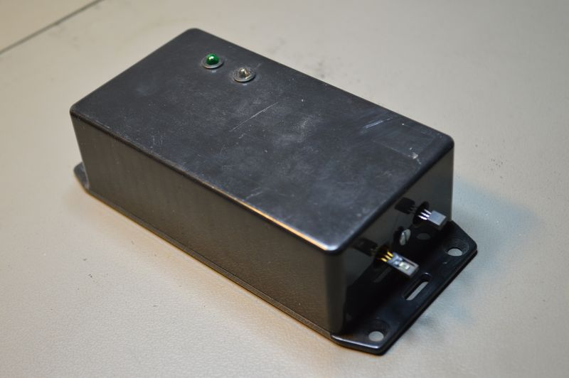

## Source code for project: [Temperature and humidity sensor (RS232)](https://link.stdout.no/o)

Temperature and humidity sensor with RS232 communication, uses an AVR ATmega8 microcontroller.

Written in basic, using [Bascom-AVR](http://www.mcselec.com/).

### Author
[Thomas Jensen](https://thomas.stdout.no)
